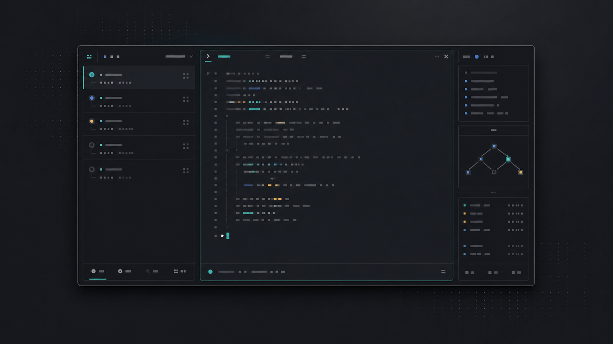

# cokacmux



> 코드뿐 아니라 작업 중 만들어진 세션까지 자산으로 관리하는 앱

`cokacmux`는 Claude Code, Codex, OpenCode, Pi, GJC가 저장해 둔 작업 세션을 한곳에 모아 보여줍니다.

작업을 하며 만들어진 대화 맥락, 제목, 시간, 작업 폴더, 실행 상태는 다음 작업의 출발점이 됩니다. `cokacmux`로 예전 세션을 찾고, 미리보고, 다시 열고, 복제해서 다른 방향으로 실험할 수 있습니다.

여러 프로젝트를 동시에 다룰 때도 agent와 terminal을 안전하게 백그라운드에 둔 채 필요한 세션으로 바로 돌아갈 수 있습니다.

`cokacmux` 자체가 새 AI 요금을 만들지는 않습니다. 다만 세션을 다시 열면, 선택한 코딩 도구는 평소처럼 자기 서비스와 통신할 수 있습니다.

---

## 목차

1. [이 앱으로 할 수 있는 일](#1-이-앱으로-할-수-있는-일)
2. [설치하기](#2-설치하기)
3. [처음 실행하기](#3-처음-실행하기)
4. [기본 사용법](#4-기본-사용법)
5. [자주 쓰는 키](#5-자주-쓰는-키)
6. [문제가 생겼을 때](#6-문제가-생겼을-때)
7. [업데이트와 제거](#7-업데이트와-제거)
8. [알아둘 점](#8-알아둘-점)
9. [사용 조건](#9-사용-조건)
10. [면책조항](#10-면책조항)

---

## 1. 이 앱으로 할 수 있는 일

### 작업 세션 모아 보기

Claude Code, Codex, OpenCode, Pi, GJC의 작업 세션을 한 화면에서 볼 수 있습니다. 최종 코드뿐 아니라 그 코드를 만들던 대화와 작업 폴더까지 같이 남겨 둡니다.

### 세션 내용 바로 읽기

목록에서 세션을 고르면 오른쪽에서 내용을 읽을 수 있습니다.

### 검색하기

`Ctrl+F`를 누르면 세션을 찾을 수 있습니다.

- 글자로 찾기: 제목, 폴더, 세션 내용에서 찾습니다.
- AI로 찾기: 선택한 코딩 도구에게 관련 세션을 찾아 달라고 합니다.

### 세션 다시 열기

세션을 고르고 `e` 또는 `Enter`를 누르면 그 작업을 다시 열 수 있습니다.

### 새 작업 열기

`Ctrl+N`을 누르면 새 명령창, `cokacdir`, 새 코딩 도구를 열 수 있습니다.

### 여러 작업을 켜 둔 채 관리하기

여러 코딩 도구와 명령창을 동시에 켜 둘 수 있습니다. 목록으로 돌아와도 작업은 꺼지지 않습니다. 필요할 때 원하는 작업을 골라 다시 들어갈 수 있습니다.

그래서 여러 프로젝트를 번갈아 보거나, 한 작업은 실행해 둔 채 다른 작업을 확인하는 식으로 사용할 수 있습니다.

### 세션 복사하기

`c`를 누르면 선택한 세션을 하나 더 만들 수 있습니다. 필요하면 작업 폴더도 함께 복사할 수 있습니다. 원본 맥락은 보존하고 다른 방향의 수정이나 다른 코딩 도구로 실험할 때 씁니다.

### 세션 삭제하기

`Delete` 또는 `d`를 누르면 세션 기록을 지울 수 있습니다. 바로 지우지 않고 먼저 물어봅니다.

---

## 2. 설치하기

### macOS / Linux

명령창에 아래 내용을 붙여 넣고 Enter를 누르세요.

```bash
curl -fsSL https://cokacmux.cokac.com/manage.sh | bash
```

### Windows

PowerShell에 아래 내용을 붙여 넣고 Enter를 누르세요.

```powershell
irm https://cokacmux.cokac.com/manage.ps1 | iex
```

설치가 끝나면 새 명령창을 열어 주세요.

### 설치 확인

```bash
cokacmux --version
```

버전 번호가 나오면 설치된 것입니다.

### 내가 쓰는 코딩 도구 확인

아래 명령 중 내가 쓰는 것만 확인하면 됩니다.

```bash
claude --version
codex --version
opencode --version
pi --help
gjc --help
```

이 중 하나라도 잘 실행되면 `cokacmux`에서 그 도구의 세션을 다시 열 수 있습니다.

---

## 3. 처음 실행하기

명령창에서 실행합니다.

```bash
cokacmux
```

처음 실행하면 `cokacmux`가 필요한 폴더를 자동으로 만듭니다.

한 번도 쓰지 않은 코딩 도구가 있어도 괜찮습니다. 그 도구의 세션만 비어 있을 뿐입니다.

화면은 크게 두 부분입니다.

| 위치 | 내용 |
|---|---|
| 왼쪽 | 세션 목록 |
| 오른쪽 | 선택한 세션 내용 |

목록에는 아래 정보가 보입니다.

| 칸 | 뜻 |
|---|---|
| 상태 | 지금 실행 중인지 보여줍니다. |
| 도구 | Claude Code, Codex, OpenCode, Pi, GJC 중 어디서 나온 세션인지 보여줍니다. |
| 제목 | 세션 이름입니다. 직접 바꿀 수 있습니다. |
| 시간 | 마지막으로 바뀐 지 얼마나 됐는지입니다. |
| 폴더 | 그 세션이 작업하던 폴더입니다. |

---

## 4. 기본 사용법

### 처음에는 이렇게 해보세요

처음에는 지우기나 위험한 실행을 하지 말고 화면 이동만 익혀 보세요.

| 순서 | 해볼 일 | 키 또는 명령 |
|---|---|---|
| 1 | 세션이 보이는지 확인 | `cokacmux --check` |
| 2 | 화면 열기 | `cokacmux` |
| 3 | 목록에서 이동 | `↑` / `↓` |
| 4 | 오른쪽 내용으로 이동 | `Tab` |
| 5 | 오른쪽 내용 읽기 | `↑` / `↓` |
| 6 | 검색창 열기 | `Ctrl+F` |
| 7 | 다시 열기 창만 열고 닫기 | `e`, `Esc` |
| 8 | 복사 창만 열고 닫기 | `c`, `Esc` |
| 9 | 삭제 창만 열고 닫기 | `Delete`, `Esc` |

### 세션 읽기

`↑` / `↓`로 세션을 고릅니다. 선택이 바뀌면 오른쪽 내용도 바뀝니다.

오른쪽 내용을 읽으려면 `Tab`을 누르세요. 다시 목록으로 돌아가려면 `Tab`을 한 번 더 누르면 됩니다.

### 검색하기

`Ctrl+F`를 누릅니다.

| 하고 싶은 일 | 방법 |
|---|---|
| 글자로 찾기 | `Enter`를 누르고 검색어를 입력합니다. |
| AI로 찾기 | `2`를 누르고 찾고 싶은 내용을 입력합니다. |
| 검색 결과 지우기 | 빈 검색어로 다시 검색하거나 `Esc`를 누릅니다. |

AI로 찾으려면 먼저 설정 화면에서 사용할 코딩 도구를 골라야 합니다. 설정 화면은 `,` 키로 엽니다.

### 세션 다시 열기

세션을 고르고 `e` 또는 `Enter`를 누릅니다.

다시 열기 창에서 `Normal`이라고 보이면 그것을 고르세요. 이것이 보통 실행입니다.

`Skip permissions`라고 보이는 선택지는 위험한 실행입니다. 코딩 도구가 파일 수정이나 명령 실행 전에 묻는 확인을 줄입니다. 내가 믿는 폴더에서만 쓰세요.

세션을 실행한 뒤 목록으로 돌아오려면 `Ctrl+]` 또는 `Ctrl+[`를 누릅니다. 이때 코딩 도구는 꺼지지 않습니다.

### 새 작업 열기

`Ctrl+N`을 누릅니다.

열 수 있는 것은 세 가지입니다.

| 선택 | 뜻 |
|---|---|
| Terminal | 화면에 보이는 이름입니다. 일반 명령창을 엽니다. |
| cokacdir | `cokacdir`를 엽니다. |
| Coding agent | 화면에 보이는 이름입니다. 새 코딩 도구를 엽니다. |

새 코딩 도구를 열 때는 Claude Code, Codex, OpenCode, Pi, GJC 중 하나를 고릅니다.

### 실행 중인 화면으로 돌아가기

코딩 도구를 실행한 뒤 목록으로 돌아와도 그 도구는 계속 살아 있습니다.

여러 작업을 켜 둔 경우에도 목록에서 원하는 작업을 고르면 바로 돌아갈 수 있습니다. 하나를 끄기 전까지는 컴퓨터 안에서 계속 대기합니다.

`Ctrl+Shift+K`로 모두 끄기 전에는 확인창이 먼저 뜹니다.

| 하고 싶은 일 | 키 |
|---|---|
| 목록으로 돌아가기 | `Ctrl+]` 또는 `Ctrl+[` |
| 다시 실행 화면으로 가기 | `Ctrl+]` 또는 `Ctrl+[` |
| 지금 실행 중인 화면 끄기 | `Ctrl+K` |
| 실행 중인 모든 것 끄기 | `Ctrl+Shift+K` 또는 `cokacmux killall` |

### 세션 복사하기

세션을 고르고 `c`를 누릅니다.

| 선택 | 뜻 |
|---|---|
| 세션만 복사 | 작업 폴더는 그대로 두고 세션 기록만 하나 더 만듭니다. |
| 폴더도 함께 복사 | 작업 폴더까지 새 폴더로 복사합니다. |

폴더까지 복사하면 시간이 걸릴 수 있습니다.

### 제목 바꾸기

세션을 고르고 `t`를 누릅니다.

제목만 바뀝니다. 원래 세션 내용은 바뀌지 않습니다.

제목 편집창에서 `Ctrl+T`를 누르면 AI가 제목 초안을 만들어 줍니다.

### 세션 삭제하기

세션을 고르고 `Delete` 또는 `d`를 누릅니다.

삭제하면 저장된 세션 기록이 실제로 지워집니다. 중요한 세션은 먼저 따로 보관하세요.

---

## 5. 자주 쓰는 키

아래는 기본 설정 기준의 단축키 전체입니다. 처음에는 세션 목록과 코딩 도구 화면에서 쓰는 키만 익히면 됩니다. 나중에 익숙해지면 선택창, 제목 편집, 설정 화면의 키를 보면 됩니다.

단축키는 `~/.cokacmux/keybinding.json`에서 바꿀 수 있습니다. 이 파일을 바꾼 뒤 저장하면 실행 중인 `cokacmux`가 다시 읽습니다. `BackTab`은 보통 `Shift+Tab`입니다.

### 세션 목록에서 쓰는 키

세션 목록은 `cokacmux`를 처음 켰을 때 보이는 화면입니다. 왼쪽에는 세션 목록이 있고, 오른쪽에는 선택한 세션의 내용이 보입니다.

| 키 | 언제 쓰나요 | 무엇을 하나요 |
|---|---|---|
| `↑`, `↓` | 목록에서 다른 세션을 고를 때 | 선택 줄을 한 칸씩 옮깁니다. 오른쪽 미리보기도 같이 바뀝니다. |
| `PageUp`, `PageDown` | 세션이 많아서 빠르게 이동하고 싶을 때 | 목록에서는 여러 줄씩 이동합니다. 오른쪽 내용에 포커스가 있으면 내용을 한 화면씩 스크롤합니다. |
| `Home`, `g` | 목록의 맨 처음으로 가고 싶을 때 | 목록에서는 첫 세션을 고릅니다. 오른쪽 내용에 포커스가 있으면 내용 맨 위로 갑니다. |
| `End`, `G` | 목록의 맨 끝으로 가고 싶을 때 | 목록에서는 마지막 세션을 고릅니다. 오른쪽 내용에 포커스가 있으면 내용 맨 아래로 갑니다. |
| `Tab` | 왼쪽 목록과 오른쪽 내용을 번갈아 보고 싶을 때 | 포커스를 목록과 미리보기 사이에서 바꿉니다. |
| `Ctrl+F` | 예전 세션을 찾고 싶을 때 | 검색 방식 선택창을 엽니다. 글자 검색과 AI 검색 중 고를 수 있습니다. |
| `v` | 목록을 다른 모양으로 보고 싶을 때 | 일반 목록 보기와 트리 보기를 바꿉니다. |
| `r` | 파일이 바뀐 것 같거나 목록을 다시 읽고 싶을 때 | 세션 목록을 다시 불러옵니다. |
| `e`, `Enter` | 선택한 세션을 다시 열고 싶을 때 | 실행 방식 선택창을 열거나, 가능한 경우 바로 다시 엽니다. |
| `Space` | 오른쪽 미리보기가 오래된 것 같을 때 | 선택한 세션의 미리보기 캐시를 버리고 다시 읽게 합니다. |
| `Ctrl+N` | 새 명령창이나 새 코딩 도구를 열고 싶을 때 | 새 작업 만들기 창을 엽니다. |
| `c` | 비슷한 일을 다른 방향으로 이어가고 싶을 때 | 선택한 세션을 복사하는 창을 엽니다. 세션만 복사하거나 작업 폴더까지 복사할 수 있습니다. |
| `t` | 세션 제목을 알아보기 쉽게 바꾸고 싶을 때 | 제목 편집창을 엽니다. |
| `,` | AI 검색이나 AI 제목 생성에 쓸 도구를 고르고 싶을 때 | 설정 화면을 엽니다. |
| `Delete`, `d` | 필요 없는 세션 기록을 지우고 싶을 때 | 삭제 확인창을 엽니다. 바로 지우지 않고 한 번 더 묻습니다. |
| `Ctrl+]`, `Ctrl+[` | 실행 중인 코딩 도구 화면으로 돌아가고 싶을 때 | 목록 화면과 agent 화면을 전환합니다. 실행 중인 작업은 꺼지지 않습니다. |
| `Ctrl+K` | 선택한 실행 중 작업 하나만 끄고 싶을 때 | 목록에서 선택한 agent 또는 명령창을 종료합니다. |
| `Ctrl+Shift+K`, `Shift+K` | 실행 중인 작업을 모두 끄고 싶을 때 | 전체 종료 확인창을 엽니다. 실수 방지를 위해 바로 종료하지 않습니다. |
| `Alt+←`, `Ctrl+Shift+←` | 왼쪽 목록을 좁히고 싶을 때 | 목록 영역의 폭을 줄입니다. |
| `Alt+→`, `Ctrl+Shift+→` | 왼쪽 목록을 넓히고 싶을 때 | 목록 영역의 폭을 늘립니다. |
| `Alt+↑`, `Ctrl+Shift+↑` | 키보드로 목록 선택을 위로 옮기고 싶을 때 | 포커스를 목록으로 돌리고 위 항목을 고릅니다. |
| `Alt+↓`, `Ctrl+Shift+↓` | 키보드로 목록 선택을 아래로 옮기고 싶을 때 | 포커스를 목록으로 돌리고 아래 항목을 고릅니다. |
| `Esc` | 검색 결과를 지우거나 앱을 닫고 싶을 때 | 검색 결과가 있으면 먼저 지웁니다. 지울 검색 결과가 없으면 종료를 요청합니다. |
| `q` | 목록 화면에서 앱을 닫고 싶을 때 | `cokacmux`를 종료합니다. 실행 중인 코딩 도구는 자동으로 꺼지지 않습니다. |
| `Ctrl+Q` | 어느 화면에서든 앱 종료를 요청하고 싶을 때 | 전역 종료 단축키입니다. 진행 중인 작업이 있으면 막힐 수 있습니다. |
| `Ctrl+C` | 목록 화면에서 강제로 끝내야 할 때 | 일반 종료가 막힐 때 쓰는 강제 종료 요청입니다. |

### 오른쪽 미리보기에서 쓰는 키

오른쪽 미리보기는 선택한 세션 내용을 읽는 곳입니다. `Tab`으로 오른쪽에 포커스를 보낸 뒤 사용합니다.

| 키 | 언제 쓰나요 | 무엇을 하나요 |
|---|---|---|
| `↑`, `↓` | 세션 내용을 조금씩 읽을 때 | 미리보기를 한 줄씩 위아래로 움직입니다. |
| `PageUp`, `PageDown` | 긴 세션을 빠르게 읽을 때 | 미리보기를 한 화면씩 위아래로 움직입니다. |
| `Home`, `g` | 내용 처음으로 가고 싶을 때 | 미리보기 맨 위로 갑니다. |
| `End`, `G` | 내용 끝으로 가고 싶을 때 | 미리보기 맨 아래로 갑니다. |
| `Tab` | 다시 목록으로 돌아가고 싶을 때 | 포커스를 왼쪽 목록으로 되돌립니다. |
| `Alt+←`, `Alt+→`, `Ctrl+Shift+←`, `Ctrl+Shift+→` | 목록과 미리보기의 폭을 조절하고 싶을 때 | 왼쪽 목록 폭을 줄이거나 늘립니다. |
| `q`, `Ctrl+Q`, `Esc` | 읽기를 끝내고 닫고 싶을 때 | 목록 화면과 같은 종료 규칙을 사용합니다. |

### 코딩 도구 화면에서 쓰는 키

코딩 도구 화면은 Claude Code, Codex, OpenCode, Pi, GJC, 일반 명령창, `cokacdir`가 실제로 떠 있는 화면입니다. 보통 키 입력은 현재 포커스가 있는 창으로 그대로 전달됩니다. 아래 키들은 `cokacmux`가 먼저 잡아 처리합니다.

| 키 | 언제 쓰나요 | 무엇을 하나요 |
|---|---|---|
| `Ctrl+]`, `Ctrl+[` | 세션 목록으로 잠깐 돌아가고 싶을 때 | 목록 화면으로 전환합니다. 현재 코딩 도구는 계속 실행됩니다. |
| sidebar 포커스에서 `Esc` | 왼쪽 agents 목록을 보고 있다가 목록 화면으로 돌아가고 싶을 때 | `Ctrl+]` 또는 `Ctrl+[`를 누른 것처럼 세션 목록으로 갑니다. |
| `Ctrl+K` | 지금 보고 있는 작업 하나를 끄고 싶을 때 | main agent에 포커스가 있으면 main을 끄고, right pane에 포커스가 있으면 right pane을 끕니다. |
| `Ctrl+Shift+K` | 켜 둔 작업을 모두 정리하고 싶을 때 | 전체 종료 확인창을 엽니다. |
| `Ctrl+N` | 코딩 도구 화면에 있으면서 새 작업을 더 열고 싶을 때 | 새 작업 만들기 창을 엽니다. |
| `Ctrl+B` | 왼쪽 agents 목록이 화면을 차지하거나 다시 필요할 때 | agents sidebar를 숨기거나 다시 보입니다. |
| `Ctrl+F` | 현재 agent 옆에 `cokacdir`를 붙여 보고 싶을 때 | 오른쪽에 `cokacdir` pane을 열거나 닫습니다. |
| `Ctrl+T` | 현재 agent 옆에 일반 명령창이 필요할 때 | 오른쪽에 terminal pane을 열거나 닫습니다. |
| `Ctrl+1` | 왼쪽 agents 목록을 키보드로 조작하고 싶을 때 | sidebar에 포커스를 줍니다. sidebar가 숨겨져 있으면 다시 보입니다. |
| `Ctrl+2` | main agent로 입력을 보내고 싶을 때 | 가운데 main pane에 포커스를 줍니다. |
| `Ctrl+3` | 오른쪽 pane으로 입력을 보내고 싶을 때 | right pane에 포커스를 줍니다. right pane이 없으면 열리지 않고 상태 메시지만 보입니다. |
| `Ctrl+←`, `Ctrl+.`, `Shift+←` | 포커스를 왼쪽 방향으로 옮기고 싶을 때 | sidebar, main, right pane 사이에서 이전 pane으로 이동합니다. sidebar가 숨겨져 있으면 sidebar는 건너뜁니다. |
| `Ctrl+→`, `Ctrl+/`, `Ctrl+_`, `Shift+→` | 포커스를 오른쪽 방향으로 옮기고 싶을 때 | sidebar, main, right pane 사이에서 다음 pane으로 이동합니다. |
| sidebar 포커스에서 `↑`, `↓` | 실행 중인 agent 목록을 고르고 싶을 때 | agents sidebar 안에서 위아래 항목으로 이동합니다. |
| `Alt+↑`, `Ctrl+Shift+↑` | 다른 실행 작업으로 빠르게 바꾸고 싶을 때 | 이전 agent로 전환합니다. |
| `Alt+↓`, `Ctrl+Shift+↓` | 다른 실행 작업으로 빠르게 바꾸고 싶을 때 | 다음 agent로 전환합니다. |
| `Ctrl+PageUp` | 여러 agent 사이를 순서대로 오갈 때 | 이전 실행 화면으로 전환합니다. |
| `Ctrl+PageDown` | 여러 agent 사이를 순서대로 오갈 때 | 다음 실행 화면으로 전환합니다. |
| `Alt+←`, `Ctrl+Shift+←` | 현재 포커스된 사이드 pane을 줄이고 싶을 때 | sidebar나 right pane의 폭을 줄입니다. |
| `Alt+→`, `Ctrl+Shift+→` | 현재 포커스된 사이드 pane을 넓히고 싶을 때 | sidebar나 right pane의 폭을 늘립니다. |
| `Shift+↑`, `Shift+↓` | agent 출력 내용을 한 줄씩 되짚어 보고 싶을 때 | 현재 포커스된 agent 화면을 한 줄씩 스크롤합니다. |
| `Shift+Alt+↑`, `Shift+Alt+PageUp`, `Alt+PageUp` | 긴 출력에서 한 화면 위로 가고 싶을 때 | 현재 포커스된 agent 화면을 크게 위로 스크롤합니다. |
| `Shift+Alt+↓`, `Shift+Alt+PageDown`, `Alt+PageDown` | 긴 출력에서 한 화면 아래로 가고 싶을 때 | 현재 포커스된 agent 화면을 크게 아래로 스크롤합니다. |
| `Shift+Home`, `Alt+Home` | 출력의 가장 오래된 부분으로 가고 싶을 때 | agent 화면의 맨 위쪽 기록으로 갑니다. |
| `Shift+End`, `Alt+End` | 다시 최신 출력으로 돌아오고 싶을 때 | agent 화면의 맨 아래쪽, 즉 현재 위치로 돌아옵니다. |
| `Ctrl+Q` | agent 화면에서도 `cokacmux`를 닫고 싶을 때 | 앱 종료를 요청합니다. 실행 중인 agent를 자동으로 끄지는 않습니다. |

`cokacdir` 화면에서는 `Shift`가 들어간 일부 키를 `cokacmux`가 잡지 않고 `cokacdir`에 넘깁니다. `cokacdir` 자체 단축키를 방해하지 않기 위해서입니다.

### 검색 방식 선택창

`Ctrl+F`를 누르면 바로 검색어를 입력하는 것이 아니라, 먼저 글자 검색과 AI 검색 중 하나를 고릅니다.

| 키 | 언제 쓰나요 | 무엇을 하나요 |
|---|---|---|
| `Esc` | 검색을 시작하지 않고 닫고 싶을 때 | 선택창을 닫습니다. |
| `Enter` | 현재 선택된 검색 방식을 쓰고 싶을 때 | 글자 검색 또는 AI 검색 입력창으로 들어갑니다. |
| `↓`, `Tab` | 다음 선택지로 옮기고 싶을 때 | 선택을 아래로 옮깁니다. |
| `↑`, `BackTab` | 이전 선택지로 옮기고 싶을 때 | 선택을 위로 옮깁니다. |
| `1` | 글자로 찾고 싶을 때 | 제목, 폴더, 대화 내용에서 직접 검색합니다. |
| `2` | 말로 설명해서 찾고 싶을 때 | AI 검색 입력창으로 갑니다. |

### 검색어 입력창과 AI 검색어 입력창

검색어를 입력하는 동안에는 일반 글자가 검색어로 들어갑니다.

| 키 | 언제 쓰나요 | 무엇을 하나요 |
|---|---|---|
| `Esc` | 검색을 그만두고 싶을 때 | 입력창을 닫습니다. 검색 중이면 취소를 요청합니다. |
| `Enter` | 입력한 말로 찾고 싶을 때 | 검색을 시작합니다. |
| `←`, `→` | 글자 사이를 고치고 싶을 때 | 커서를 왼쪽이나 오른쪽으로 옮깁니다. |
| `Home`, `End` | 검색어 맨 앞이나 맨 끝으로 가고 싶을 때 | 커서를 처음 또는 끝으로 옮깁니다. |
| `Backspace`, `Delete` | 잘못 입력한 글자를 지우고 싶을 때 | 커서 앞 또는 커서 위치의 글자를 지웁니다. |
| 일반 글자 | 검색어를 입력할 때 | 검색어에 글자를 넣습니다. |
| 검색 중 `q`, `Ctrl+Q` | 검색이 끝나기 전에 앱을 닫고 싶을 때 | 검색을 닫고 종료를 요청합니다. |
| 검색 중 `Ctrl+C` | 검색 중에도 강제로 끝내야 할 때 | 검색을 닫고 강제 종료를 요청합니다. |

### 제목 편집창

`t`로 제목 편집창을 열면 대화 내용은 그대로 두고 표시 제목만 바꿉니다.

| 키 | 언제 쓰나요 | 무엇을 하나요 |
|---|---|---|
| `Esc` | 제목 변경을 취소하고 싶을 때 | 편집창을 닫고 원래 제목을 유지합니다. |
| `Enter` | 새 제목을 저장하고 싶을 때 | 입력한 제목을 저장합니다. |
| `←`, `→`, `Home`, `End` | 제목 중간을 고치고 싶을 때 | 커서를 움직입니다. |
| `Backspace`, `Delete` | 제목 일부를 지우고 싶을 때 | 글자를 지웁니다. |
| `Ctrl+T` | 제목을 직접 짓기 어렵거나 요약 제목이 필요할 때 | 설정된 AI 도구에게 제목 초안을 만들게 합니다. |
| 일반 글자 | 제목을 입력할 때 | 제목에 글자를 넣습니다. |

### 새 작업 만들기 창

`Ctrl+N`을 누르면 새 terminal, `cokacdir`, 새 coding agent를 만들 수 있습니다.

| 키 | 언제 쓰나요 | 무엇을 하나요 |
|---|---|---|
| `Esc` | 새 작업 만들기를 취소하고 싶을 때 | 창을 닫습니다. |
| `Enter` | 현재 선택한 새 작업을 시작하고 싶을 때 | 새 작업을 실행합니다. |
| `↓`, `Tab` | 다음 입력 항목으로 가고 싶을 때 | 종류, 폴더, 도구, 권한 항목 사이를 이동합니다. |
| `↑`, `BackTab` | 이전 입력 항목으로 돌아가고 싶을 때 | 이전 항목으로 이동합니다. |
| `→`, `Space` | 선택 항목의 다음 값을 고르고 싶을 때 | 작업 종류, 코딩 도구, 권한 모드를 다음 값으로 바꿉니다. |
| `←` | 선택 항목의 이전 값을 고르고 싶을 때 | 작업 종류, 코딩 도구, 권한 모드를 이전 값으로 바꿉니다. |
| 폴더 칸에서 `←`, `→`, `Home`, `End` | 폴더 경로를 고칠 때 | 커서를 움직입니다. |
| 폴더 칸에서 `Backspace`, `Delete` | 폴더 경로를 지울 때 | 경로 글자를 지웁니다. |
| 폴더 칸에서 일반 글자 | 새 작업을 열 폴더를 입력할 때 | 폴더 경로에 글자를 넣습니다. |

### 실행 방식 선택창

대화를 `e` 또는 `Enter`로 다시 열 때, 도구에 따라 실행 방식을 고르는 창이 뜹니다.

| 키 | 언제 쓰나요 | 무엇을 하나요 |
|---|---|---|
| `Esc` | 다시 열기를 취소하고 싶을 때 | 선택창을 닫습니다. |
| `Enter` | 선택한 방식으로 열고 싶을 때 | 선택한 방식으로 코딩 도구를 실행합니다. |
| `↓` | 다음 실행 방식으로 가고 싶을 때 | 선택을 아래로 옮깁니다. |
| `↑` | 이전 실행 방식으로 가고 싶을 때 | 선택을 위로 옮깁니다. |
| `1` | 보통 방식으로 열고 싶을 때 | `Normal`을 선택합니다. |
| `2` | 확인 질문을 줄이는 위험한 방식이 필요할 때 | `Skip permissions`를 선택합니다. 믿을 수 있는 폴더에서만 쓰세요. |

### 세션 복사 옵션창

`c`를 누르면 선택한 대화를 복사합니다. 같은 도구로 복사할 수도 있고, 다른 도구로 이어갈 수도 있습니다.

| 키 | 언제 쓰나요 | 무엇을 하나요 |
|---|---|---|
| `Esc`, `3` | 복사를 취소하고 싶을 때 | 옵션창을 닫습니다. |
| `Enter` | 현재 선택한 방식으로 복사하고 싶을 때 | 복사를 시작합니다. |
| `→`, `↓` | 다음 복사 방식으로 가고 싶을 때 | 선택을 다음 항목으로 옮깁니다. |
| `←`, `↑` | 이전 복사 방식으로 돌아가고 싶을 때 | 선택을 이전 항목으로 옮깁니다. |
| `Tab` | 복사할 대상 도구를 다음으로 바꾸고 싶을 때 | Claude, Codex, OpenCode, Pi, GJC 중 다음 가능한 도구로 이동합니다. |
| `BackTab` | 복사할 대상 도구를 이전으로 바꾸고 싶을 때 | 이전 가능한 도구로 이동합니다. |
| `1` | 대화 기록만 복사하고 싶을 때 | 작업 폴더는 복사하지 않고 세션만 복사합니다. |
| `2` | 작업 폴더까지 함께 복사하고 싶을 때 | 가능한 경우 폴더 데이터까지 복사합니다. |
| `m` | 다른 도구로 이어갈 때 전달 방식을 바꾸고 싶을 때 | 전체 내용을 직접 넣을지, 파일 참조 방식으로 넘길지 바꿉니다. |

### 삭제, 폴더 생성, 데이터 복원 확인창

이 창들은 실수로 중요한 것을 지우거나 만들지 않도록 한 번 더 묻는 창입니다.

| 상황 | 키 | 언제 쓰나요 | 무엇을 하나요 |
|---|---|---|---|
| 삭제 확인 | `Esc`, `n`, `N`, `2` | 삭제를 취소하고 싶을 때 | 아무것도 지우지 않고 닫습니다. |
| 삭제 확인 | `Enter` | 현재 선택된 답을 실행하고 싶을 때 | `Delete`가 선택되어 있으면 지우고, `Cancel`이면 닫습니다. |
| 삭제 확인 | `→`, `↓`, `Tab` | 선택을 다음 답으로 옮길 때 | 선택을 옮깁니다. |
| 삭제 확인 | `←`, `↑`, `BackTab` | 선택을 이전 답으로 옮길 때 | 선택을 옮깁니다. |
| 삭제 확인 | `1`, `y`, `Y` | 정말 지우겠다고 바로 고를 때 | 삭제를 선택하고 실행합니다. |
| 폴더 생성 확인 | `Esc`, `n`, `N`, `2` | 폴더를 만들지 않으려 할 때 | 창을 닫습니다. |
| 폴더 생성 확인 | `Enter` | 현재 선택된 답을 실행할 때 | 선택에 따라 폴더를 만들거나 취소합니다. |
| 폴더 생성 확인 | `→`, `↓`, `Tab` | 다음 답으로 이동할 때 | 선택을 옮깁니다. |
| 폴더 생성 확인 | `←`, `↑`, `BackTab` | 이전 답으로 이동할 때 | 선택을 옮깁니다. |
| 폴더 생성 확인 | `1`, `y`, `Y` | 필요한 폴더를 만들겠다고 바로 고를 때 | 폴더 생성을 선택하고 실행합니다. |
| 데이터 복원 확인 | `Esc`, `n`, `N`, `2` | 복사된 작업 폴더를 복원하지 않고 열고 싶을 때 | 복원을 건너뜁니다. |
| 데이터 복원 확인 | `Enter` | 현재 선택된 답을 실행할 때 | 선택에 따라 복원하거나 건너뜁니다. |
| 데이터 복원 확인 | `→`, `↓`, `Tab` | 다음 답으로 이동할 때 | 선택을 옮깁니다. |
| 데이터 복원 확인 | `←`, `↑`, `BackTab` | 이전 답으로 이동할 때 | 선택을 옮깁니다. |
| 데이터 복원 확인 | `1`, `y`, `Y` | 작업 폴더를 복원하겠다고 바로 고를 때 | 폴더 데이터를 복원합니다. |

### 전체 종료 확인창

`Ctrl+Shift+K` 또는 `Shift+K`로 여러 실행 작업을 한꺼번에 끄기 전에 나오는 창입니다.

| 키 | 언제 쓰나요 | 무엇을 하나요 |
|---|---|---|
| `Esc`, `n`, `N`, `2` | 전체 종료를 취소하고 싶을 때 | 아무것도 끄지 않고 닫습니다. |
| `Enter` | 현재 선택된 답을 실행하고 싶을 때 | `Kill`이 선택되어 있으면 모두 끄고, `Cancel`이면 닫습니다. |
| `→`, `↓`, `Tab` | 다음 답으로 이동할 때 | 선택을 옮깁니다. |
| `←`, `↑`, `BackTab` | 이전 답으로 이동할 때 | 선택을 옮깁니다. |
| `1` | 정말 모두 끄겠다고 바로 고를 때 | 전체 종료를 실행합니다. |

### 설정 화면

`,`를 누르거나 AI 기능을 처음 쓸 때 설정 화면이 열립니다. 여기서는 AI 검색과 AI 제목 생성에 사용할 도구, 실행 파일 경로 같은 값을 고릅니다.

| 키 | 언제 쓰나요 | 무엇을 하나요 |
|---|---|---|
| `Esc` | 설정을 저장하지 않고 돌아가고 싶을 때 | 이전 화면으로 돌아갑니다. 경로 편집 중이면 편집만 취소합니다. |
| `Enter` | 설정을 저장하거나 경로 편집을 시작/끝낼 때 | 일반 항목에서는 저장합니다. 경로 항목에서는 편집을 시작하거나 편집을 끝냅니다. |
| `←`, `→` | 설정 종류를 바꾸고 싶을 때 | AI, 프로그램 경로 같은 설정 섹션을 바꿉니다. |
| `↓`, `Tab` | 다음 설정 항목으로 가고 싶을 때 | 아래 항목으로 이동합니다. |
| `↑`, `BackTab` | 이전 설정 항목으로 돌아가고 싶을 때 | 위 항목으로 이동합니다. |
| `1` | AI 기능을 쓰지 않으려 할 때 | AI provider를 `none`으로 고릅니다. |
| `2` | Claude를 AI 기능에 쓰고 싶을 때 | AI provider를 Claude로 고릅니다. |
| `3` | Codex를 AI 기능에 쓰고 싶을 때 | AI provider를 Codex로 고릅니다. |
| `4` | OpenCode를 AI 기능에 쓰고 싶을 때 | AI provider를 OpenCode로 고릅니다. |
| `5` | Pi를 AI 기능에 쓰고 싶을 때 | AI provider를 Pi로 고릅니다. |
| `Space` | 현재 선택된 설정 값을 바꾸고 싶을 때 | 토글이나 선택형 항목을 바꿉니다. |
| 경로 항목에서 일반 글자 | 실행 파일 경로를 입력할 때 | 바로 경로 편집을 시작하고 글자를 넣습니다. |
| 경로 편집 중 `←`, `→`, `Home`, `End` | 경로 중간을 고칠 때 | 커서를 움직입니다. |
| 경로 편집 중 `Backspace`, `Delete` | 경로 글자를 지울 때 | 커서 앞 또는 커서 위치의 글자를 지웁니다. |

### 알림창과 작업 진행 중

| 상황 | 키 | 언제 쓰나요 | 무엇을 하나요 |
|---|---|---|---|
| 알림창 | `Enter`, `Esc` | 메시지를 읽고 닫을 때 | 알림창을 닫습니다. |
| 폴더 복사 같은 일반 작업 진행 중 | `Ctrl+Q` | 작업은 그대로 두고 앱 종료를 요청해야 할 때 | 가능한 경우 종료 요청을 처리합니다. 다른 키는 작업이 끝날 때까지 막힙니다. |
| 세션 복사 작업 진행 중 | `Esc` | 복사를 취소하고 롤백하고 싶을 때 | 취소를 요청합니다. 안전한 시점에 되돌립니다. |

### Codex transcript 스크롤 보조 키

Codex를 실행할 때는 Codex 안의 transcript/pager가 아래 키를 이해하도록 `cokacmux`가 설정을 보태 줍니다. 이 키들은 Codex 내부 스크롤을 돕기 위한 것입니다. 같은 키를 `cokacmux`가 먼저 쓰는 상황에서는 `cokacmux` 동작이 우선할 수 있습니다.

| 키 | Codex 안에서 하는 일 |
|---|---|
| `↑`, `Shift+↑` | 한 줄 위로 스크롤 |
| `↓`, `Shift+↓` | 한 줄 아래로 스크롤 |
| `PageUp`, `Shift+Space`, `Ctrl+B`, `Alt+Shift+↑`, `Alt+Shift+PageUp`, `Alt+PageUp` | 한 화면 위로 스크롤 |
| `PageDown`, `Space`, `Ctrl+F`, `Alt+Shift+↓`, `Alt+Shift+PageDown`, `Alt+PageDown` | 한 화면 아래로 스크롤 |
| `Home`, `Shift+Home`, `Alt+Home` | 맨 위로 이동 |
| `End`, `Shift+End`, `Alt+End` | 맨 아래로 이동 |

---

## 6. 문제가 생겼을 때

### 대화가 하나도 안 보여요

아래를 확인하세요.

1. Claude Code, Codex, OpenCode, Pi, GJC 중 하나를 한 번이라도 사용했는지 확인합니다.
2. 아래 명령을 실행합니다.

```bash
cokacmux --check
```

3. 그래도 안 되면 아래 명령으로 실행한 뒤 나온 기록을 확인합니다.

```bash
cokacmux --debug
```

### 대화는 보이는데 다시 열리지 않아요

내가 쓰는 코딩 도구가 설치되어 있고 로그인되어 있는지 확인하세요.

```bash
claude --version
codex --version
opencode --version
pi --help
gjc --help
```

### `Ctrl+]` / `Ctrl+[`가 안 돼요

일부 명령창은 특정 키를 앱에 전달하지 않을 수 있습니다. 먼저 `Ctrl+]`를 써 보세요.

### Windows에서 글자가 깨져요

Windows Terminal을 써 보세요. 글꼴은 한글이 잘 보이는 글꼴을 고르면 됩니다.

### 화면이 깨져 보여요

명령창을 더 넓게 만든 뒤 `r`을 눌러 새로고침하세요.

---

## 7. 업데이트와 제거

### 업데이트

설치할 때 쓴 명령을 다시 실행하면 새 버전으로 바뀝니다.

macOS / Linux:

```bash
curl -fsSL https://cokacmux.cokac.com/manage.sh | bash
```

Windows:

```powershell
irm https://cokacmux.cokac.com/manage.ps1 | iex
```

### 제거

설치된 실행 파일을 지우면 됩니다.

설정과 임시 파일까지 지우고 싶으면 아래 폴더를 지우세요.

| 운영체제 | 폴더 |
|---|---|
| macOS / Linux | `~/.cokacmux/` |
| Windows | `C:\Users\사용자이름\.cokacmux\` |

원래 코딩 도구들이 저장한 대화 기록은 따로 있습니다. 위 폴더를 지워도 자동으로 지워지지 않습니다.

---

## 8. 알아둘 점

cokacmux는 내 컴퓨터에 저장된 대화 기록을 읽어서 보여줍니다.

대화를 다시 열 때는 내 컴퓨터에 설치된 `claude`, `codex`, `opencode`, `pi`, `gjc` 명령을 실행합니다.

`q`나 `Ctrl+Q`로 cokacmux를 종료해도 실행 중인 코딩 도구는 자동으로 꺼지지 않습니다. 하나만 끄려면 `Ctrl+K`를 쓰고, 모두 끄려면 `Ctrl+Shift+K` 또는 `cokacmux killall`을 쓰세요.

대화 삭제, 폴더 복사, 위험한 실행을 하기 전에는 중요한 파일을 따로 보관하세요.

문제가 생기거나 새 기능을 제안하고 싶으면 아래 주소를 이용하세요.

https://github.com/kstost/cokacmux

---

## 9. 사용 조건

이 프로그램의 사용 조건은 MIT 라이선스입니다.

자세한 내용은 [`LICENSE`](LICENSE) 파일에 있습니다.

---

## 10. 면책조항

이 프로그램은 있는 그대로 제공됩니다. 잘 작동한다는 보장, 내 상황에 꼭 맞는다는 보장, 문제가 절대 생기지 않는다는 보장은 없습니다.

이 프로그램을 쓰는 동안 생기는 모든 결과는 사용자가 직접 확인하고 책임져야 합니다. 여기에는 대화 기록 삭제, 파일 삭제, 폴더 복사 실패, 잘못된 폴더에서의 실행, 코딩 도구가 만든 변경, 코딩 도구 사용 비용, 중요한 자료 손실이 포함됩니다.

위험한 실행을 고르면 코딩 도구가 파일을 바꾸거나 명령을 실행하기 전에 묻는 확인이 줄어들 수 있습니다. 이 기능은 믿을 수 있는 폴더에서만 사용하세요.

중요한 파일이나 대화 기록은 사용 전에 반드시 따로 보관하세요. 이 프로그램의 만든 사람과 기여자는 사용 중 생긴 손해, 비용, 자료 손실, 보안 문제에 대해 책임지지 않습니다.
